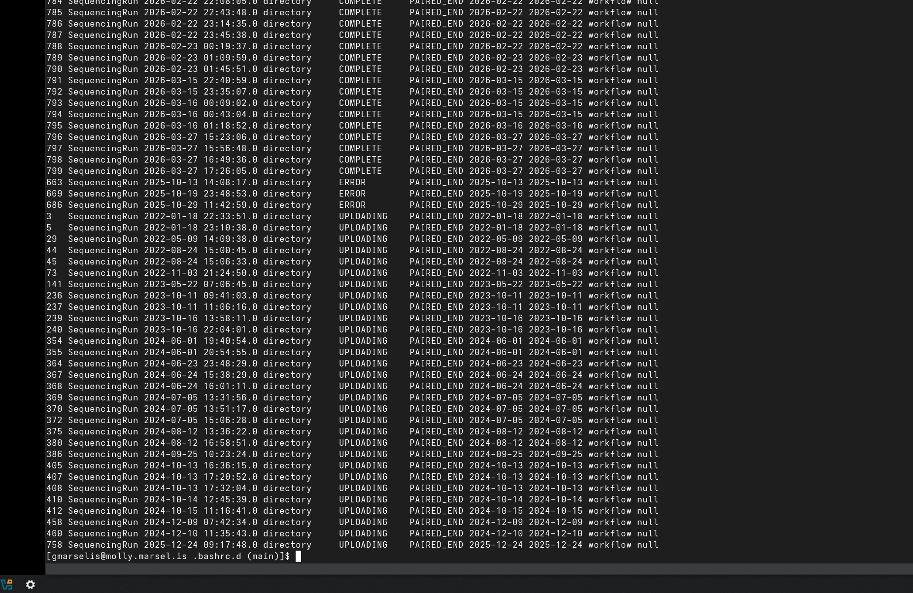
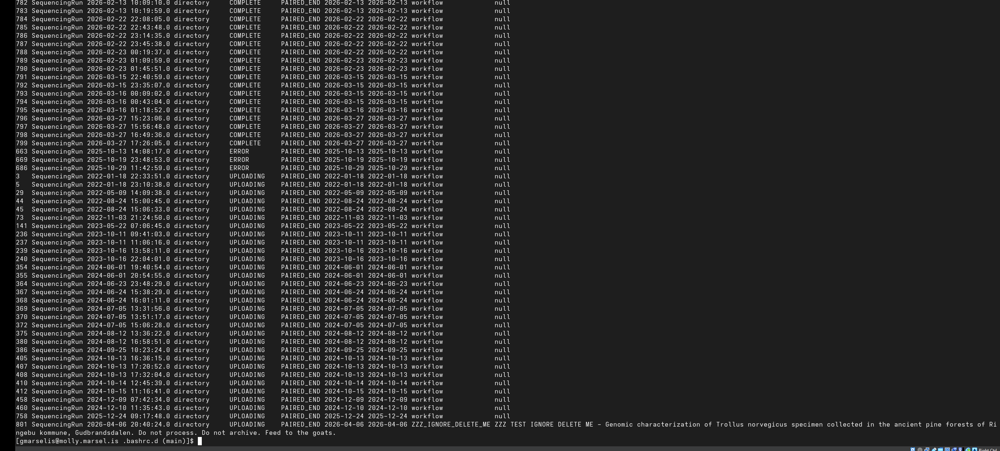
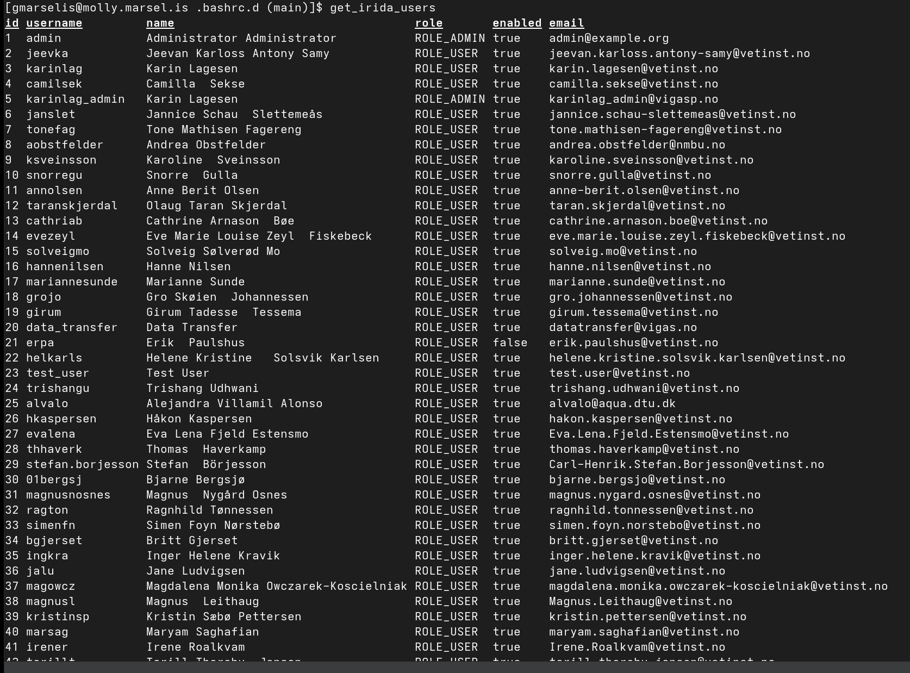
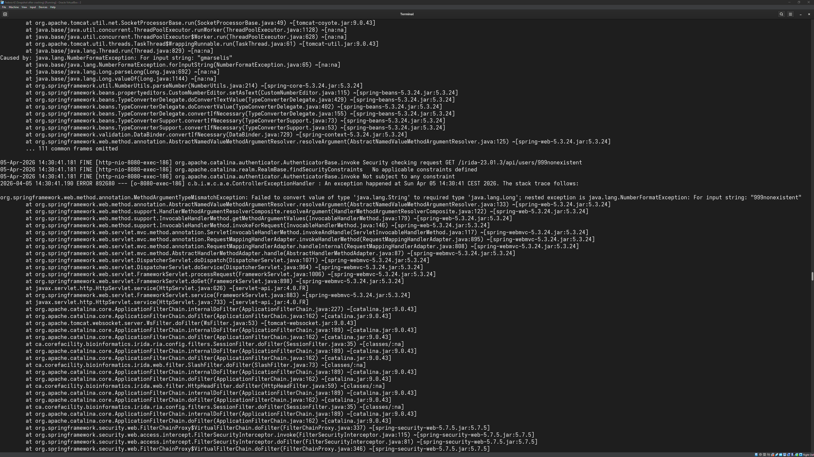
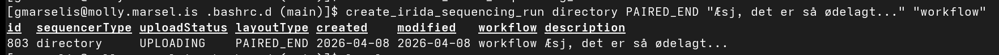

# ~/.bashrc.d

NVI POSIT/NIRD/IRIDA/VIGASP bash helper functions for interacting with the
[IRIDA](https://phac-nml.github.io/irida-documentation/) REST API hosted at
`http://irida.vigasp.vetinst.no:8080/irida-23.01.3`.

Developed as part of the [DemultiplexRawSequenceData](https://github.com/NorwegianVeterinaryInstitute/DemultiplexRawSequenceData)
pipeline work at the Norwegian Veterinary Institute.

---

## Prerequisites

* `bw serve` running as a systemd user service (`bw-serve.service`)
* FortiClient VPN connected
* `jq`, `mlr`, `curl` installed

---

## Usage

Functions are sourced automatically via `.bashrc`. Authenticate before using any `get_irida_*` functions:

```bash
get_irida_token
```

For functions that require admin access:

```bash
get_irida_token_admin
```

---

## Functions

### Authentication

| Function                | Description                                                                                                                                        |
| ----------------------- | -------------------------------------------------------------------------------------------------------------------------------------------------- |
| `get_irida_token`       | authenticate as regular user and export `IRIDA_TOKEN`                                                                                              |
| `get_irida_token_admin` | authenticate as admin and export `IRIDA_TOKEN`. Shows WARNING banner with 15-second abort countdown. Use `--skip-countdown` to skip the countdown. |

### Connectivity checks

| Function                   | Description                                |
| -------------------------- | ------------------------------------------ |
| `check_bitwarden_serve`    | check if `bw-serve.service` is running     |
| `check_fortigate_vpn`      | check if FortiClient VPN is connected      |
| `check_irida_connectivity` | check if IRIDA server is reachable         |
| `check_irida_token`        | check if `IRIDA_TOKEN` is set and non-null |

### Projects

| Function                     | Description                                                                                           |
| ---------------------------- | ----------------------------------------------------------------------------------------------------- |
| `get_irida_projects`         | list all accessible projects                                                                          |
| `get_irida_project`          | get a single project by ID                                                                            |
| `get_irida_project_analyses` | list analyses for a project                                                                           |
| `get_irida_project_hash`     | get the hash of a project's sample data                                                               |
| `get_irida_project_metadata` | get metadata for all samples in a project                                                             |
| `get_irida_project_users`    | list users in a project                                                                               |
| `create_irida_project`       | create a new project. Confirmed working as non-admin (RBAC gap, see issue #12)                        |
| `mod_irida_project`          | update project fields via PATCH. Confirmed working as non-admin for member projects (RBAC gap, see issue #12). Patchable: name, projectDescription, organism, genomeSize, minimumCoverage, maximumCoverage. |

### Samples

| Function                               | Description                                                                                      |
| -------------------------------------- | ------------------------------------------------------------------------------------------------ |
| `get_irida_samples`                    | list samples in a project                                                                        |
| `get_irida_sample_metadata`            | get metadata for a single sample                                                                 |
| `get_irida_sample_files_metadata`      | list sequence files for a sample                                                                 |
| `get_irida_sample_pairs_metadata`      | list paired-end files for a sample                                                               |
| `get_irida_sample_unpaired_metadata`   | list single-end files for a sample. NOTE: workaround for broken `/sequenceFiles/unpaired` endpoint (see issue #4) |
| `get_irida_sample_assemblies_metadata` | list assemblies for a sample                                                                     |
| `get_irida_sample_fast5_metadata`      | list fast5 files for a sample                                                                    |
| `create_irida_sample_in_project`       | create a new sample in a project                                                                 |
| `mod_irida_sample`                     | update sample fields via PATCH. Patchable: sampleName, description, organism, collectionDate, collectedBy, strain, isolate, latitude, longitude, geographicLocationName, isolationSource. |
| `delete_irida_sample_from_project`     | delete a sample from a project                                                                   |

### Sequence files

| Function                           | Description                                                                                                     |
| ---------------------------------- | --------------------------------------------------------------------------------------------------------------- |
| `get_irida_download_sequence_file` | download a single sequence file                                                                                 |
| `get_irida_download_sequence_pair` | download both R1 and R2 for a sample pair                                                                       |
| `upload_irida_fastq_pair`          | upload a paired-end fastq pair to a sample via `POST /api/samples/{id}/pairs`. Confirmed working as non-admin (RBAC gap, see issue #12). Sequencing run must be in UPLOADING state. |
| `upload_irida_fast5`               | upload a fast5 file to a sample via `POST /api/samples/{id}/fast5`. Confirmed working as non-admin (RBAC gap, see issue #12). |
| `delete_irida_sequence_file`       | delete a sequencing object from a sample via `DELETE /api/samples/{id}/{objectType}/{objectId}`. objectType: unpaired, pairs, fast5. objectId is the sequencing object ID, not the file ID. Confirmed working as non-admin (RBAC gap, see issue #12). NOTE: the documented path `DELETE /api/samples/{id}/sequenceFiles/{fileId}` is wrong and returns 500 (see issue #4). |

### Sequencing runs

| Function                                      | Description                                                                                                                                                                |
| --------------------------------------------- | -------------------------------------------------------------------------------------------------------------------------------------------------------------------------- |
| `get_irida_sequence_run`                      | list all sequencing runs or get a single run by ID. Supports `--sort-id`, `--group-status`. Requires admin token to see all runs; non-admin users see only their own runs. |
| `create_irida_sequencing_run`                 | create a new sequencing run. Required: SEQUENCER_TYPE, LAYOUT_TYPE. Optional: DESCRIPTION, WORKFLOW. Confirmed working as non-admin (RBAC gap, see issue #12).             |
| `check_irida_sequencing_run_upload_status`    | check the upload status of a single sequencing run. Wrapper around `get_irida_sequence_run` for scripting clarity. No WARNING, no countdown.                               |
| `change_irida_sequencing_run`                 | update fields on a sequencing run via PATCH. Confirmed working as non-admin (RBAC gap, see issue #12). Patchable: uploadStatus, sequencerType, layoutType, description. workflow is not patchable. |
| `delete_irida_sequencing_run`                 | delete a sequencing run by ID. Requires admin token.                                                                                                                       |

### Analyses

| Function                                 | Description                                                                                                                          |
| ---------------------------------------- | ------------------------------------------------------------------------------------------------------------------------------------ |
| `get_irida_analysis_submissions`         | list all analysis submissions. NOTE: blocks on Galaxy — cached output with 15-second countdown. See issue #4.                        |
| `get_irida_analysis_submissions_by_type` | list analysis submissions by workflow type                                                                                           |
| `get_irida_analysis_submission`          | get a single analysis submission by ID                                                                                               |
| `get_irida_analysis_status`              | get status of an analysis submission                                                                                                 |
| `get_irida_analysis_result`              | get the analysis result object for a completed submission via `GET /api/analysisSubmissions/{id}/analysis`                           |
| `get_irida_analysis_results`             | get outputs of a completed analysis                                                                                                  |
| `get_irida_analysis_output_files`        | list output files for an analysis                                                                                                    |

### Users

| Function                  | Description                                                                                                                              |
| ------------------------- | ---------------------------------------------------------------------------------------------------------------------------------------- |
| `get_irida_users`         | list all IRIDA users with roles and email addresses. In theory, it requires admin token. (See issue #5)                                  |
| `get_irida_user_projects` | list all projects a user is a member of via `GET /api/users/{username}/projects`                                                         |

### Version

| Function            | Description                  |
| ------------------- | ---------------------------- |
| `get_irida_version` | get the IRIDA server version |

### Utilities

| Function    | Description                         |
| ----------- | ----------------------------------- |
| `ldapwhois` | look up a user in Active Directory  |
| `nird`      | get NIRD credentials from Bitwarden |
| `saga`      | get SAGA credentials from Bitwarden |

---

## Reference documents

* `IRIDA_API_Reference.pdf` / `IRIDA_API_Reference.png` - API reference card covering all documented endpoints, parameters, and known bugs
* `IRIDA_API_URL_Reference.txt` - quick reference of all API URLs

---

## Test scripts

* `irida_function_tests.sh` - function test runner. Work in progress.
* `irida_test_stress_analysis_output.sh` - stress test for analysis output retrieval. Note: this script can cause the IRIDA host to become unresponsive. Use with caution.

---

## Tab completion

All tab completions require `IRIDA_TOKEN` to be set. Completions use the format
`identifier:name` - the `:` separator is intentional to help identify entries at a glance.
Analysis names and sequencing run labels with spaces display with underscores in tab completion.

### Example: get_irida_sequence_run



Group runs by upload status to quickly identify stuck or failed uploads:



### Example: get_irida_users

All IRIDA users, including their roles and email addresses, are accessible via the API:



---

## Known issues

### IRIDA 23.01.3 server-side routing bug

`GET /api/samples/{id}/sequenceFiles/unpaired` returns HTTP 500 regardless of input, even when
called with a valid numeric sample ID. IRIDA's servlet routing attempts to parse the path segment
`unpaired` as a Java `Long` fileId, fails to cast, and throws a `NumberFormatException` before the
request reaches the controller. The same bug affects `GET /api/sequencingrun/miseqrun` and
`GET /api/samples/{id}/sequenceFiles/fast5`. See issue #4.

`get_irida_sample_unpaired_metadata` works around this by fetching all files via
`GET /api/samples/{id}/sequenceFiles` and subtracting paired file IDs fetched from
`GET /api/samples/{id}/pairs`.

### DELETE /api/samples/{id}/sequenceFiles/{fileId} is broken

Returns HTTP 500 with `NullPointerException` in `SequencingObjectServiceImpl.readSequencingObjectForSample`
(line 144). Fails regardless of file type (fast5, paired fastq) and regardless of admin or non-admin
token. No workaround available via the REST API. See issue #4.

### IRIDA fails silently under load

IRIDA seems to assume that the software is running on bare metal. In the NREC virtual environment
and even under medium to heavy API load, IRIDA stops responding without notifying the client: requests
hang indefinitely. The only indication that something is wrong is in the Tomcat server logs. There
is no timeout or error returned to the client.



### IRIDA mangles UTF-8 in sequencing run fields

Description and workflow fields containing non-ASCII characters (e.g. Norwegian æøå) are stored and
retrieved with garbled encoding. The terminal is UTF-8; the corruption originates server-side in IRIDA.
Confirmed on VIGASP 23.01.3.



### IRIDA REST API does not enforce role-based access control

The IRIDA web UI restricts certain actions to admin or project manager roles. The REST API does not
enforce the same restrictions. Any authenticated user with a valid Bearer token can perform the
following operations that the web UI restricts to admins or project managers:

- `POST /api/projects` — create projects
- `POST /api/projects/{id}/users` — add any system user to any project they are a member of
- `DELETE /api/projects/{id}/users/{username}` — remove any user from any project they are a member of
- `POST /api/samples/{id}/pairs` — upload paired-end files to any accessible sample
- `POST /api/samples/{id}/fast5` — upload fast5 files to any accessible sample
- `POST /api/sequencingrun` — create sequencing runs
- `PATCH /api/sequencingrun/{id}` — update sequencing run fields including uploadStatus
- `PATCH /api/projects/{id}` — update project metadata for member projects

The following endpoints correctly enforce access control:

- `POST /api/users` — 403 as non-admin
- `DELETE /api/users/{id}` — 403 as non-admin
- `PATCH /api/users/{id}` — 200 for own user, 403 for other users
- `POST /api/projects/{id}/samples` — 403 for non-member projects

See issue #12 for full details and screen captures.

---

## Notes

* All functions use absolute paths to binaries (`/usr/bin/curl`, `/usr/bin/jq`, `/usr/bin/mlr`)
* Credentials are always retrieved from Bitwarden. Nothing is hardcoded, no credentials exist on disk.
* OAuth bearer token expires after 12 hours. The client secret itself does not expire.
* IRIDA does not perform server-side checksum verification on uploads. The integrity of uploaded files is entirely the responsibility of the upload client.
* IRIDA does not update `uploadStatus` server-side. The upload client is entirely responsible for setting it to `COMPLETE`. FastQC processing appears to be triggered on a timer (~15 seconds after upload), not on `uploadStatus` change.
* The actual upload endpoints are `POST /api/samples/{id}/pairs` and `POST /api/samples/{id}/fast5`, not the paths listed in the IRIDA REST API documentation.
* The IRIDA REST API documentation is available at https://phac-nml.github.io/irida-documentation/developer/rest/

---

## Test Data

The fast5 test file `test_output/f6dee372-3d33-45e8-8557-7f549f5bca71.fast5` is from the
"Example dataset containing Fast5 and BAM files" dataset published on figshare by the Delter project.
https://figshare.com/articles/dataset/Example_dataset_containing_Fast5_and_BAM_files/26093869

Delter: https://github.com/nkuyfq/Delter

| Hash   | Value                                                                                                                            |
| ------ | ---------------------------------------------------------------------------------------------------------------------------------|
| sha256 | 41b81c81f9a30d0acc7ff365347140926b0ac0e31d22fc5516a3821b1cf7be72                                                                 |
| sha512 | 083e579f4bb1f46d1684dbf93d75dec83d6cbba179b27cbf12f6bc6fb54832e3188eeeaa6dfefb38b6bb1013d7be5c383d34335f3e36d05f3d91077ccec9613e |

---

## License

Copyright (C) 2026 George Marselis <george.marselis@vetinst.no>

This program is free software: you can redistribute it and/or modify it under the terms
of the GNU General Public License as published by the Free Software Foundation, either
version 3 of the License, or (at your option) any later version.
